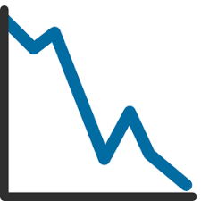

> ## Marc ALPHONSUS

## Data Science, +8 ans d'XP

&nbsp;
&nbsp;

> Data scientist senior avec un portfolio allant du scoring à la détection de fraude, en passant par la reconnaissance d'images et la modélisation du langage dans des contextes agile et big data. Je recherche un poste de lead tech data ou data scientist senior. A propos de moi : je suis un data nerd orienté produit infusé à la philosophie devops et ayant le goût du travail en équipe.
Ce qui me plaît le plus dans le job? La créativité et le niveau d'abstraction nécessaires pour le design de modèles et leur industrialisation.  
> Mes domaines de prédilections tournent autour du Deep Learning en particulier le traitement du langage naturel et l'apprentissage par renforcement. Aussi, j'aime coder, kaggle, le café et les comics (l'ordre est susceptible de varier).  
  
  
      
###### #NLP #activelearning #CV #eli5 #RL #federated

&nbsp;
&nbsp;
&nbsp;
&nbsp;

-----------------------------                                  -----------------------------------------------------------------------------------------------------------------------------------------------
Niort, Nouvelle Aquitaine                                                                                                                                                             alphonsus.marc@gmail.com
32 ans, nationalité Française                                  [linkedin](http://linkedin.com/in/marc-alphonsus) / [github](https://github.com/marcalph)
Permis A, B                                                                                                                                                                                  +33 6 62 62 62 48
-----------------------------                                   ----------------------------------------------------------------------------------------------------------------------------------------------

&nbsp;
&nbsp;
&nbsp;
&nbsp;

------

###  Expérience 

#### CGI  Lead ML engineer  2018 - 2021

> Manager le lab IA CGI en offrant une vitrine des savoirs-faire Data Science. Constuire et valoriser la stratégie IA des clients Grand Ouest.
  
##### IMA :

* DeepCall: *IA d'assistance téléphonique - Combinaison d'un modèle d'ASR/STT et de modèles de traitements du langages (NER, CLassification, Similarité) pour assister et accélérer l'assistance lors des pannes et accidents de la route*;  
*Process mis en place : Identification de la langue parlée, retranscription automatique de la conversation, extraction d'informations, APIs, géolocalisation du client, délégation d'un dépanneur/fourniture de service (taxi, hôtel...) et envoi d'un SMS récapitulatif* > `pytorch, keras, Go, docker`
  
##### MACIF :

* Macif NLP: *Création des modèles de traitement des flux texte pour le groupe (routage/classification, extraction d'entités - i.e. NER, analyse du sentiment)- amélioration de la performance de 85% sur 3 classes à* **92% sur 56 classes** > `tensorflow, transformers, spacy, docker`
* Hub IA: *Exposition d'une plateforme centralisée de modèles d'IA sécurisée et monitorée utilisables par tous les salariés du groupe sous forme d'un catalogue swagger d'API *#mlops* > `WSGI, API Gateway, docker`
* AutoML Workflow : *Conception d'un pipeline de réentraînement automatique des modèles en production - Les modèles sont auto-alimentés grâce à une boucle de feedback des utilisateurs et réentrainés de manière spontannée mensuellement (active learning, multitask-learning)* > `python, gitlab CI, docker `
* RAD/LAD: *Mise en place d'un service automatique d'analyse de documents (classification automatique et OCR) avant GED* **95% sur 80 classes** > `pytorch, docker`
* MeetUP:  *Définition d'une stratégie data à l'échelle du département et évangélisation des concepts clés de la data science auprès des différentes directions du groupe* `OKR, Gslides, Jupyter`
* Chatbot EPI: *refonte l'UX de l'espace personnel internaute - la mise en place de l'IA a permis de tenir les objectifs clés de l'entreprise (délai de traitement d'une demande <1 jour) avec une meilleure qualification du besoin (extraction du produit, du bénéficiaire, etc)* > `tensorflow, spacy, rasa`

##### CGI - Lab IA Grand Ouest :

* Management et mentorat de collaborateurs
* Avant-vente, cadrage/gestion de projet
* Veille technologique et mise en place des learning days
* Conférences et vulgarisation

#### MAIF  Data scientist  2014 - 2018

> Apporter aux départements porteurs de projets, l'expertise nécessaire en apprentissage statistique et concevoir des outils de demain au service du sociétaire.

* Mail: *Routage automatisé des e-mails et résumé automatique, devenu* [Mélusine](https://github.com/MAIF/melusine) *; design de l'architecture des réseaux neuronaux et des algorithmes de résumés extractifs* > `tensorfow, scikit-learn, docker`
* MAIF & Go: *Tarification d'une offre automobile connectée à partir des comportements de conduite remontés via capteurs GPS (IoT)* > `pySpark, R, caret`
* Valeur Sociétaire: *Modélisation de la rentalibité des clients et prospects à horizon long (LTV)* > `pySpark, Hadoop Map/Reduce`
* Téléphonie: *Prévision de la charge d'appels pour dimensionnement RH des plateaux téléphoniques* **taux d'erreur à 5%, proposition de publication** > `R, caret`
* Détection d'anomalies: *Identification de risques sous-assurés (fraude & devoir de conseil)* > `scikit-learn`

#### IRIAF  Chargé de TD Machine Learning  2017 - 2019

> Initier des étudiants à l'apprentissage automatique - programme: théorie de la décision, régression logistique, SVM, CART, forêts aléatoires et réseaux de neurones simples et convolutionnels.  

#### MAPA  Statisticien  2013 - 2014

> Concevoir et réaliser des études visant à expliquer et corriger les dérives tarifaires du portefeuille, l'élasticité au prix des sociétaires et les résultats financiers.  

&nbsp;
&nbsp;

------

###  Hard skills & extra curriculum 
**Compétitions**
:   **Magnet Driven Data x NOAA x NASA**: top 20 (700 teams, 2021) #timeseries  
    **Hackathon AfLPC x LineUp7**: top 2 (20 teams, 2020) #data4good  
    **Hackathon IMA**: top 1 (30 teams, 2019)  #audio  

&nbsp;
&nbsp;

**Projets choisis**
:   **TextNets**: Mes modèles autour du NLP, réplications d'articles, analyse de similarité textuelle, résumé automatique, traduction, search...  
    **DeepCount**: Dénombrement sur image fortement peuplées, estimation par density map  

&nbsp;
&nbsp;
&nbsp;
&nbsp;

**Langages**: `Python, R, SAS, Go`  
**Langues**: `English, Français, Deutsch, 日本語 (notions)`  
**Frameworks**: `tensorflow, pytorch, scikit-learn, Apache Spark, Hadoop, opengym`  
**Cloud**: `AWS, GCP`  
**Basics**: `UNIX, algorithms, git, docker, Kubernetes, redis, MongoDB, SQL`  

&nbsp;
&nbsp;

------

###    Diplômes & MOOCs 

**2019**
:   **Spinning up Reinforcement Learning**; OpenAI  
    **6.S094**; MIT

**2018**
:   **CS224n, CS229, CS231n**; Stanford University

**2017**
:   **Deep Learning Specialization**; Deeplearning.ai x Coursera

**2014**
:   **Machine Learning**; Stanford University x Coursera  
    **Deep Learning**; Google x Udacity

**2013**
:   **Master, Statistiques Appliquées**; Université de Poitiers

**2010**
:   **Licence, Mathématiques Informatique et Applications**; Université Paris V 